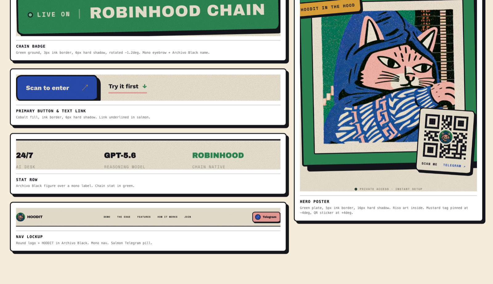

# Hoodit brand kit

Everything you need to make Hoodit marketing material without opening the code.
Every asset below is already in this repo, so the links work on GitHub and on a
fresh clone.

**Hoodit** is an AI trading bot for Robinhood Stock Tokens on Robinhood Chain.
You talk to it in plain English, it builds the transaction, you confirm.
It lives in Telegram and on the web.

- Live site: <https://hoodit-sepia.vercel.app>
- Live chat app: <https://hoodit-sepia.vercel.app/app>
- Tagline: **Talk it. Trade it.**

---

## 1. Assets

### Logo

| Asset | Preview | Format | Use it for |
|---|---|---|---|
| [`hoodit-logo.jpg`](../public/hoodit-logo.jpg) | Round sword-cat on green | JPG, 512×512 | The one and only logo. Profile pictures, avatars, favicons, anywhere a single mark stands for Hoodit. |
| [`app/icon.svg`](../app/icon.svg) | The same logo, clipped to a circle | SVG | The browser-tab favicon. Generated from the logo; don't edit by hand. |

There is no vector version and no simplified alternate mark. If you need one at
a size where the artwork stops reading, ask for a redraw rather than
substituting something else.

The round logo is already circular and already has its own edge. **Do not add a
black ring, border, or outline around it.** Place it directly on the background.

Other logo rules:

- Keep clear space around it equal to roughly a quarter of its width.
- Never stretch it, recolour it, add a drop shadow, or rotate it.
- Never put it on a busy photo. Cream, cobalt, or green grounds only.
- Minimum size 24px.

### Wordmark

There is no wordmark image file. **HOODIT** is set live in Archivo Black,
uppercase, letter-spacing `0.08em`. Pair it to the right of the round logo with a
gap of about a third of the logo's width.

### Key visuals

These are the hero pieces. The two MP4s are the animated versions of the stills
and are what the live site actually plays.

| Asset | Format | Where it runs | Use it for |
|---|---|---|---|
| [`hero-cat.mp4`](../public/hero-cat.mp4) | MP4, 624×624, 5.2s, silent | Homepage hero poster | The signature loop. Social video, demos, anywhere you have motion. |
| [`hero-cat.jpg`](../public/hero-cat.jpg) | JPG, 624×624 | Video poster frame | Still fallback for the hero, email, print. |
| [`demo-cat.mp4`](../public/demo-cat.mp4) | MP4, 624×624, 5.2s, silent | Beside the chat demo | Secondary loop. The ninja stance reads as "fast, does it for you". |
| [`demo-cat.jpg`](../public/demo-cat.jpg) | JPG, 624×624 | Video poster frame | Still fallback. |
| [`cta-cat.jpg`](../public/cta-cat.jpg) | JPG, 1000×1000 | Closing call-to-action panel | The highest-resolution cat. Best choice for print, large social, or any crop. |

Both MP4s are silent and loop cleanly. Never add a soundtrack that implies
financial advice or guaranteed returns.

### Interface elements



[`components.png`](components.png) is a reference sheet captured from the live
site: the chain badge, the primary button and text link, the stat row, the nav
lockup, and the hero poster with its mustard tag and QR sticker. Match these when
you build a layout. It shows how the outline, hard shadow, and slight rotation
work together at real sizes.

### Spot graphics

Two small vector drawings used on the site as supporting graphics. They are not
mascot art and never stand in for the cat.

| File | Subject | Where it appears | Good for |
|---|---|---|---|
| [`chart-scene.svg`](illustrations/chart-scene.svg) | Rising bars with an arrow | "Less menu. More signal." | Performance, markets, growth |
| [`money-scene.svg`](illustrations/money-scene.svg) | Banknotes and coins | The "Fund" step | Funding, deposits, pricing |

Both are generated from [`app/illustrations.tsx`](../app/illustrations.tsx). If
that file changes, regenerate them rather than editing the SVGs by hand.

**The mascot is the painted riso cat, and only the riso cat** — the logo, the two
videos, and [`cta-cat.jpg`](../public/cta-cat.jpg). There is no vector mascot.
Earlier drafts of this site used a flat vector cat; it is gone from the design and
must not reappear in marketing.

### Social card

[`og.png`](../public/og.png) is the image that appears when someone shares a
Hoodit link. **It is currently off-brand** — see [Known gaps](#6-known-gaps).

---

## 2. Colour

Cream paper is the ground. Ink is every line. Cobalt is the brand. Green means
Robinhood Chain and money. Salmon is the cat. Mustard is a spark, never a field.

| Swatch | Name | Hex | Use |
|---|---|---|---|
| 🟨 | Paper | `#f4ecd9` | Background for nearly everything |
| ⬛ | Ink | `#15161c` | Text, outlines, hard shadows |
| 🟦 | Cobalt | `#2b4fb4` | Primary accent, buttons, the hood |
| 🟩 | Green | `#2f8b57` | Robinhood Chain, money, CTA panels |
| 🟩 | Mint | `#8ed1aa` | Soft green fills, success states |
| 🟥 | Salmon | `#f3a39e` | The cat, secondary accent |
| 🟧 | Mustard | `#e8a93c` | Highlights and coins only |

Full list with deeper shades and usage notes: [`tokens.json`](tokens.json).

Rules:

- Outlines are **Ink**, never pure black `#000000`.
- Mustard is a highlight. If more than about a tenth of the canvas is mustard,
  it's too much.
- Green carries the Robinhood Chain association. Don't use it for unrelated
  accents.
- Two accents per piece, maximum. Cobalt plus one other.

---

## 3. Type

| Role | Font | How to set it |
|---|---|---|
| Headlines | **Archivo Black** | UPPERCASE, tight tracking, lines stacked close together |
| Body | **Work Sans** | Sentence case, regular to semibold |
| Labels, captions, data | **Space Mono** | UPPERCASE, wide tracking |

All three are free on Google Fonts. Headlines are big and blunt — short lines,
two or three words each, stacked. The second line is often the coloured one:

> TALK IT.
> **TRADE IT.**   ← cobalt

---

## 4. The look

Hoodit is a riso print, not a SaaS dashboard. Five things make it:

1. **Grain.** A fine noise texture over everything. Flat colour looks wrong.
2. **Hard shadows.** Solid offset in ink with zero blur, like a sticker lifted
   off the page. Never a soft glow.
3. **Thick outlines.** 2–4px ink outline on every card, button, and chip.
4. **Uneven corners.** Corner radii are deliberately irregular so shapes look
   drawn, not machined.
5. **Slight rotation.** Cards sit a degree or two off square.

Avoid: gradients, glassmorphism, soft drop shadows, thin hairline borders,
stock photography, 3D renders, neon-on-black crypto styling.

---

## 5. Voice and copy

Confident, plain, a little sly. The cat is competent and unbothered, never
hyper. Short sentences. No hype, no rocket emoji, no "to the moon".

Approved headlines, in use on the site:

- Talk it. Trade it.
- Less menu. More signal.
- One chat. A whole desk.
- In before the group chat notices.
- Your next trade starts with a text.
- Try the bot before you scan.

Supporting line:

> The AI trading bot that turns plain English into on-chain stock trades.
> No command syntax. No tab switching. Just text Hoodit.

Say: describe the outcome, review the transaction, you keep the final say,
no command syntax, on-chain, Robinhood Chain.

Don't say: guaranteed, risk-free, passive income, financial advice, "our AI
predicts", anything implying returns.

### Required disclaimers

Carry these on anything about trading. They are not optional.

> Stock Tokens are tokenized exposure, not underlying shares.

> Hoodit does not provide financial advice. Transactions are built for your
> review and require your confirmation.

Robinhood Stock Tokens are not available to U.S. persons or in restricted
jurisdictions. Don't run acquisition campaigns targeting those audiences.

**Hoodit is an independent product built on Robinhood Chain. It is not
affiliated with, endorsed by, or sponsored by Robinhood.** Never use Robinhood's
logo, wordmark, or brand colours, and never phrase anything as a partnership.
"Built for Robinhood Chain" and "live on Robinhood Chain" are fine.

---

## 6. Known gaps

Worth fixing before a launch push. Flag to engineering.

1. **The social card is off-brand.** [`og.png`](../public/og.png) is from the
   previous dark-green-and-acid-yellow design. Every shared link currently
   previews in a look the site no longer uses. It needs a rebuild in the riso
   palette with the cat.
2. **A stale icon file is still in the repo.** [`public/favicon.svg`](../public/favicon.svg)
   is a leftover generic blue icon from the project template. It is not Hoodit
   and is not what the site serves — the real favicon is
   [`app/icon.svg`](../app/icon.svg). Ignore it; don't use it anywhere.
3. **The QR code on the site is fake.** The hero QR is a hand-drawn pattern that
   encodes nothing — scanning it does nothing. Never reproduce it in any
   material. A fix that blurs it and stamps it COMING SOON is written but not
   yet merged (branch `victor/hoodit-qr-coming-soon`).
4. **The Telegram bot hasn't shipped.** `@HOODIT_AI` on the site is a
   placeholder. Don't publish a handle or a "message us on Telegram" call to
   action until the real bot is live and the handle is confirmed.
5. **No real domain yet.** Everything points at `hoodit-sepia.vercel.app`. Hold
   anything printed until the production domain is live.

---

## 7. Recipes

**A square social post.** Cream background, grain on top. Cat video or
[`cta-cat.jpg`](../public/cta-cat.jpg) in a cream card with a 3px ink outline and
a `12px 12px 0` ink shadow, rotated about -1.5°. Headline in Archivo Black
uppercase beneath, second line in cobalt. Logo plus HOODIT bottom-left. Mono
disclaimer bottom edge at about 60% opacity ink.

**A short video.** Open on [`hero-cat.mp4`](../public/hero-cat.mp4), cut to a
screen recording of the chat at `/app`, end on the closing panel: green ground,
cream headline, mustard button. Silent or light instrumental only.

**A slide deck.** Cream slides, ink text, cobalt for emphasis. One illustration
per slide from [`illustrations/`](illustrations). Section dividers get a green
or cobalt full-bleed ground with cream type.

**Exporting a new still from the videos.** The MP4s are 624×624. To pull a frame:

```bash
ffmpeg -i public/hero-cat.mp4 -ss 00:00:02 -frames:v 1 -q:v 2 frame.jpg
```

**Regenerating the illustration SVGs** after
[`app/illustrations.tsx`](../app/illustrations.tsx) changes: ask engineering, or
open <https://hoodit-sepia.vercel.app>, inspect the SVG, and copy it out —
replacing each `var(--name)` with the matching hex from
[`tokens.json`](tokens.json).

---

## Questions

Design and copy questions go to the Hoodit team. Anything about the tokens or
regenerating assets is in [`tokens.json`](tokens.json) and
[`app/globals.css`](../app/globals.css).
