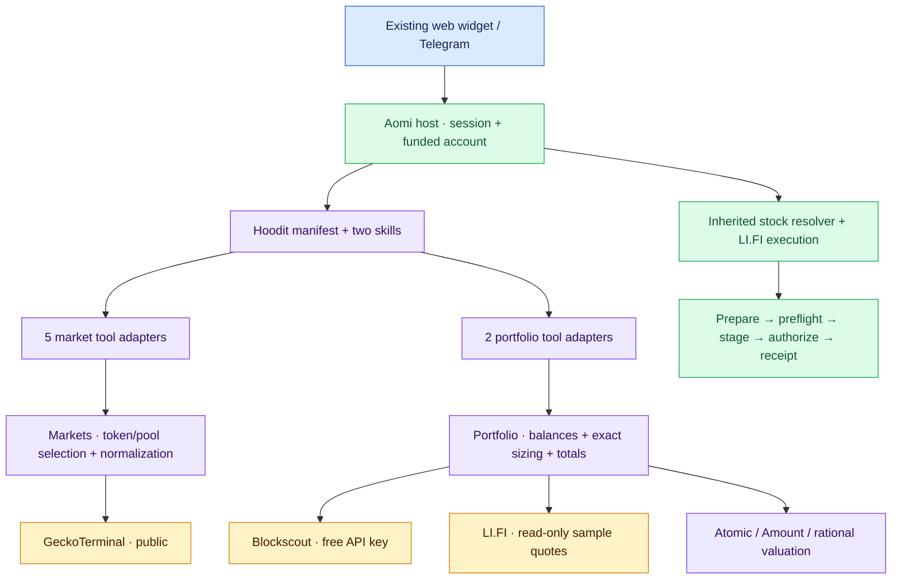

# Hoodit v1: design review and implementation record

Reviewed 2026-09-17 against Hoodit commit `30f8347b2e1d08732528eb417d49b3e918b8575f` and the supplied `hoodit-v1-plan.zip`.

This document began as a design review of the pre-v1 repository. Hoodit v1.2.0
has since been implemented in this checkout, but it has not been deployed or
trade-certified by this document. Sections using “proposed,” “recommendation,”
or design-sketch signatures preserve the reasoning that led to the final code;
they are not descriptions of the current file layout. The canonical wire
contract is now `contracts/hoodit-v1/tool-contracts.json`, and current validation
evidence is recorded in `docs/hoodit-v1-validation.md`.

**Implemented source scope:** nine read tools, two skills, one Rust crate, and
the inherited host execution workflow. Wallet reads use Blockscout's free
authenticated API rather than Etherscan. No backend crate, indexer, database,
or frontend rewrite was added. Actual trade execution and deployment acceptance
remain separate host-level work.

## Review baseline and what was retained (historical)

| Current file / surface | Observed state | v1 treatment |
|---|---|---|
| `apps/hoodit/src/lib.rs` | Stock-only preamble; three ordinary tools; one skill-injected deployment probe | Replace with small manifest, external preamble, two real skills, seven skill-owned tools |
| `apps/hoodit/src/client.rs` | Public Robinhood HTTP client, stock DTOs, global TTL caches, `rust_decimal` helpers | Replace with three provider clients and exact amount types; retain useful timeout/cache lessons, not stock-specific code |
| `apps/hoodit/src/tool.rs` | Stock search, snapshot, corporate actions, probe; hand-built JSON | Replace with typed arguments/results and thin SDK adapters |
| `Cargo.toml` / `apps/hoodit/Cargo.toml` | One member, SDK pinned to 5.1.0; app 0.2.1; `rlib` and `cdylib` | Keep one crate and ABI shape; retain SDK pin until deployment compatibility is measured |
| `app/app/hoodit-widget.tsx` | Existing wallet widget, application 2938613, chain pinned; optional Privy, browser-wallet fallback | Preserve identity/session flow; update stock-only copy |
| `lib/agent-relay.ts`, `lib/chat-fetch.ts`, relay tests | Scoped transport using caller authorization and origin; no server credential substitution | Preserve; no provider keys in this layer |
| `apps/hoodit/test.json`, README, landing/app copy | Stock/probe-era behavior and claims | Rewrite scenarios and affected claims after real tools exist |
| `.aomi/*`, GitHub build wiring | Existing deployment integration | Preserve; source push alone is not release verification |

The baseline client created a new HTTP client per call, used unbounded per-symbol quote caching, and retried 429s with blocking sleeps. That was adequate scaffolding for three small reads, but was not the right foundation for multi-provider wallet fan-out. The implementation retains the SDK's synchronous `DynAomiTool::run` interface with bounded work underneath it.

At review time, six Rust tests covered only the retired stock app and the
supplied validator checked 68 schemas and 72 synthetic assertions. Current
results are recorded separately in `docs/hoodit-v1-validation.md`; retaining
the historical counts here avoids presenting old review evidence as final.

## Provider and key decisions

| Dependency | Pilot decision | Key / cost implications |
|---|---|---|
| Blockscout | Free-tier authenticated API at `api.blockscout.com`; chain 4663 | Free API key required for this documented path; no paid subscription. The direct explorer returned 403 in this environment, so keyless access is not an accepted dependency |
| GeckoTerminal | Public V2 for discovery, token/pool stats, candles and trades | No API key. Shared rate limit; conservatively start at ten requests/minute and bounded bursts |
| LI.FI valuation | Small read-only quote client | Key optional; free key recommended. Keyless limits are too constrained for repeated full-page valuation at even modest usage |
| LI.FI execution / RPC / wallet infrastructure | Existing Aomi host | No new Hoodit execution service. Verify deployed host credentials, chain support and route support; this review does not establish its operational cost |
| Privy | Optional existing widget feature | Public app ID if enabled. Browser-wallet fallback already exists; no new paid auth dependency is required by this design |
| Telegram | Existing host integration, if included in acceptance scope | Host bot credential/configuration must exist; no new bot implementation in this crate |
| News / Brave | Not required for the seven v1 tools | Remove the old unconditional news-tool assumption. If live news is wanted, separately verify the host's search entitlement/key |
| Hosting / model usage / gas / swap fees | Existing deployment and trading costs | No paid data subscription does not mean the entire app or actual trades have zero operating cost |

Blockscout currently advertises Robinhood free access at 5 requests/second and 100K credits/day, with access across API tiers. Validate actual endpoint credit costs and response headers with the issued key. The word “PRO” in its API name does not mean a paid plan is required. [Blockscout Robinhood API](https://docs.blockscout.com/robinhood-api)

GeckoTerminal's authentication guide says no authentication is required. Its public specification and support material describe differing throughput limits, so do not size production from an optimistic single number. [Authentication](https://apiguide.geckoterminal.com/authentication), [public specification](https://api.geckoterminal.com/docs/v2/swagger.json), [rate-limit support](https://support.coingecko.com/hc/en-us/articles/22612838274841-Does-GeckoTerminal-have-an-API)

LI.FI's official sources also disagree: API docs list 200 unauthenticated quote-related requests per two hours, while its help center lists 75 `/quote` requests per two hours and a free-key option. Honor actual account limits and response headers. Budgeting against 75 means twenty quoted holdings consume over a quarter of that allowance in one refresh. [API limits](https://docs.li.fi/api-reference/rate-limits), [help-center limits and free key](https://help.li.fi/hc/en-us/articles/12111455848859-What-is-the-LI-FI-API-rate-limit)

Secrets: declare `BLOCKSCOUT_API_KEY` and `LIFI_API_KEY` as optional at app load using SDK 5.1.0 `Secret::new(..., false)`. Resolve per call from the host-delivered context. Missing Blockscout configuration should return `PROVIDER_NOT_CONFIGURED` for the affected balance tool while markets remain available. Neither keys nor provider URLs become model arguments. Never log request URLs containing Blockscout's key query parameter, raw error bodies, or secret-bearing `Debug` representations.

## Review findings and necessary amendments

1. **Blockscout inventory requires a pagination redesign.** Its REST `/addresses/{address}/tokens?type=ERC-20` returns `items` and `next_page_params`, not Etherscan page/offset semantics. Do not fetch pages 1…N to emulate random access, truncate and lose rows, or rely on an in-memory page-number map that breaks after restart. [Official REST specification](https://github.com/blockscout/blockscout-api-v2-swagger/blob/main/swagger.yaml)
2. **Raw balance arithmetic cannot use the current decimal implementation.** ERC-20 balances may use all 256 bits; the plan also asks for 36 fractional digits for derived ratios. Use bounded arbitrary-precision integer/rational arithmetic. `rust_decimal` is not the universal balance/valuation type for this contract.
3. **The original 20-row cap and LI.FI budget are separate concepts.** Blockscout's provider page may be 50 rows. Read and retain the entire provider page; independently bound valuation requests. Do not assume it accepts `page_size=20` without evidence.
4. **“Everything is frozen” conflicts with the requested provider change.** Replace `etherscan` provenance, paid-key errors/examples, pagination and limits together. Version the amended draft (proposed `1.1.0`) instead of quietly making responses violate `1.0.0`.
5. **Default wallet reads should be fast.** Proposed change: `include_quotes=false` by default for portfolio, with explicit quote requests when the user asks for value. Preserve `get_holding`'s explicit fractional estimate; use `include_quote=false` for an actual fractional sell before fresh host preparation. This is a recommendation to amend the attachment, not an existing contract default.
6. **Stock data is a real product removal.** The inherited stock skill supplies canonical resolution, not replacement underlying bid/ask, corporate actions or multipliers. Confirm their removal. The new preamble must not retain the old mandatory snapshot call. If official reference data remains wanted, reconsider the seven-tool scope deliberately.
7. **Schema defaults do not enforce runtime semantics.** Defaulted Rust fields must reject explicit `null` if the contract only permits omission. Address/decimal newtypes must validate on deserialization; `JsonSchema` alone does not validate argument values. Require unknown-field rejection in tool inputs, while allowing upstream additive fields in provider DTOs.
8. **Partial output needs implementation-level invariants.** Provider failure is not zero balance; null market cap is not FDV; an indexed inventory page is not an atomic on-chain snapshot. A later page cannot have a complete-wallet total. A quote failure cannot hide the holding.
9. **SDK manifest tests are insufficient for skill gating.** SDK 5.1.0 includes injected descriptors in the full manifest even when `tools=[]`. Assert seven unique descriptors and two owners, then test actual visibility before/after activation on the host. Local host source still enforces one first-pass activation and defaults to a 4,000-token budget; verify deployed behavior separately.
10. **Timeouts must apply across retries and fan-out.** A ten-second request timeout plus retries on twenty rows is not a thirty-second portfolio deadline. Every scheduled request gets the remaining deadline, and rate limits stop work rather than create a long hidden queue.

## Architecture



Execution stays outside the app read clients. The app never invokes another model tool through chat callbacks to obtain values. Its LI.FI client discards calldata, approvals and transaction requests. Only the inherited host workflow stages or signs.

## Implemented file layout

The final implementation stayed smaller than the design sketch below:

```text
apps/hoodit/src/
  lib.rs                  # manifest: two skills, seven hidden tools, secrets
  app.rs                  # shared HTTP runtime, cache, budgets, deadlines
  amount.rs               # bounded uint256 and exact rational formatting
  model.rs                # response-envelope and identity helpers
  providers.rs            # GeckoTerminal, Blockscout, LI.FI adapters
  tools.rs                # public tool facade and provider-error mapping
  tools/
    markets/
      mod.rs              # market re-exports and shared normalization
      search.rs           # token search tool
      discovery.rs        # pool discovery tool
      token.rs            # exact-token market tool
      candles.rs          # candle history tool
      trades.rs           # recent trades tool
      normalization.rs    # shared argument and provider normalization
    portfolio/
      mod.rs              # portfolio re-exports
      inventory.rs        # wallet inventory tool
      holding.rs          # exact-holding tool
      valuation.rs        # shared balance and quote normalization
  preamble.md
  skills/{markets,portfolio}.md
apps/hoodit/tests/contracts.rs
contracts/hoodit-v1/
```

Provider DTOs remain consolidated, while public tools are split by operation and
share domain-specific normalization modules. `client.rs`, `tool.rs`, and the
disposable injected-tool skill from the old app are absent from the final source
tree.

## Historical proposed files and ownership (superseded)

One existing crate, with these modules as they acquire real code:

```text
apps/hoodit/
  Cargo.toml
  src/
    lib.rs                 # module declarations + dyn_aomi_app!
    app.rs                 # HooditApp, shared Runtime, per-call services
    preamble.md
    skills/
      markets.md           # activation/interpretation recipes
      portfolio.md         # funded wallet, sizing, partial totals
    tools/
      mod.rs
      markets.rs           # five Args structs + DynAomiTool impls
      portfolio.rs         # two Args structs + DynAomiTool impls
    model/
      mod.rs
      identity.rs          # Address, TokenId, PoolId, Token
      response.rs          # ToolResponse<T>, Meta, Source, Warning, ToolError
      market.rs            # Pool, stats, candles, trades, seven-tool data types
      portfolio.rs         # Holding, Valuation, Quote, summary, InventoryCursor
    providers/
      mod.rs
      http.rs              # transport, deadlines, status parsing, bounded retries
      geckoterminal.rs     # endpoint DTOs; relationships and provider normalization
      blockscout.rs        # inventory, balances, metadata, continuation validation
      lifi.rs              # quote DTOs and read-only normalization
    markets.rs             # shared pool selection; five market operations
    portfolio.rs           # inventory/holding operations and bounded valuation
    amount.rs              # uint256 validation, exact formatting, rational marks
    cache.rs               # bounded TTL cache + provider budget accounting
  tests/
    contracts.rs           # real Rust outputs vs amended schemas
    market_workflows.rs    # provider fixtures including quote-side/v4 cases
    portfolio_workflows.rs # pagination, native, partial values, sizing, budget
    manifest.rs            # names, ownership, optional secrets
    fixtures/              # provider responses, no keys; synthetic clearly marked
contracts/hoodit-v1/
  tool-contracts.json       # amended canonical specification
  examples.json
  validate_contracts.py
```

`model/market.rs` owns market output types; portfolio output types belong only in `model/portfolio.rs`. Provider response shapes stay private to each provider module. There is no second generic “domain layer,” provider plugin registry, repository trait, or separate crate per vendor. `Markets` and `Portfolio` exist because they coordinate several operations; HTTP details do not belong in SDK wrappers.

## Key Rust types and methods

These signatures are preserved design sketches, not the compiled implementation.

```rust
#[derive(Clone, Default)]
pub struct HooditApp {
    runtime: Arc<OnceLock<Arc<Runtime>>>,
}

struct Runtime {
    http: Http,
    cache: Cache,
    budgets: ProviderBudgets,
}

// Created on demand. Default app creation performs no network I/O and cannot
// panic because an optional provider key is missing.
impl HooditApp {
    fn runtime(&self) -> Result<Arc<Runtime>, ToolError>;
    fn markets(&self, ctx: &DynToolCallCtx) -> Result<Markets, ToolError>;
    fn portfolio(&self, ctx: &DynToolCallCtx) -> Result<Portfolio, ToolError>;
}

struct ReadContext {
    deadline: Instant,
    refresh: bool,
    credential_scope: CredentialScope,
    sources: Vec<Source>,
    warnings: Vec<Warning>,
}

struct Markets { runtime: Arc<Runtime>, gecko: GeckoTerminal }
impl Markets {
    fn search(&self, args: SearchArgs) -> ToolResponse<SearchData>;
    fn discover(&self, args: DiscoverArgs) -> ToolResponse<DiscoverData>;
    fn token(&self, args: TokenArgs) -> ToolResponse<TokenData>;
    fn candles(&self, args: CandlesArgs) -> ToolResponse<CandlesData>;
    fn trades(&self, args: TradesArgs) -> ToolResponse<TradesData>;
    fn pool(&self, token: Address, explicit: Option<PoolId>,
            read: &mut ReadContext) -> Result<SelectedPool, ToolError>;
}

struct Portfolio {
    runtime: Arc<Runtime>,
    explorer: Blockscout,
    quotes: Lifi,
}
impl Portfolio {
    fn page(&self, args: PortfolioArgs) -> ToolResponse<PortfolioData>;
    fn holding(&self, args: HoldingArgs) -> ToolResponse<HoldingData>;
    fn value(&self, wallet: Address, holding: &Holding, bps: BasisPoints,
             usdg: &Token, read: &mut ReadContext) -> Valuation;
}

impl Blockscout {
    fn inventory(&self, wallet: Address, cursor: Option<InventoryCursor>,
                 read: &mut ReadContext) -> Result<InventoryPage, ToolError>;
    fn balance(&self, wallet: Address, token: TokenId,
               read: &mut ReadContext) -> Result<Atomic, ToolError>;
    fn token(&self, token: Address,
             read: &mut ReadContext) -> Result<Token, ToolError>;
}

impl Lifi {
    fn quote(&self, request: QuoteRequest,
             read: &mut ReadContext) -> Result<Quote, QuoteFailure>;
}
```

`Runtime` contains no caller credential. Clients created for an invocation receive that call's secret; connection pools and public caches can be shared. Credential-scoped caches and limits use a non-reversible internal identity, never the raw key. Verify whether the deployed host shares a plugin instance across sessions before relying on app-owned budgets; an instance-local limiter is not fleet-wide coordination. Single pilot egress or an explicit aggregate budget is required.

The SDK's `Clone + Default + Send + Sync` app requirement is already compatible with this structure. `Arc<OnceLock<...>>` avoids fallible HTTP setup in `Default`; initialize with a fallible method and cache only success. Use the existing blocking reqwest interface initially. A bounded worker pool of at most four valuation reads can remain inside this synchronous tool boundary; do not create an async runtime per request.

```rust
struct Address([u8; 20]);         // strict parse; lowercase wire format
struct PoolId(String);           // opaque bounded provider identifier
struct Atomic(BigUint);          // construction enforces <= 2^256 - 1
struct BasisPoints(u16);         // construction enforces 1..=10_000
struct Amount { atomic: Atomic, decimals: Option<u8> }

impl Atomic {
    fn fraction(&self, bps: BasisPoints) -> Atomic;
}
impl Amount {
    fn formatted(&self) -> Option<String>;
}
impl Valuation {
    fn quoted(balance: &Amount, input: &Amount, output: &Amount,
              quote: Quote) -> Result<Self, ToolError>;
}
impl PortfolioSummary {
    fn from_holdings(holdings: &[Holding], coverage: &InventoryCoverage,
                     requested: bool) -> Self;
}
```

`fraction` multiplies in a wider integer before division and floors once. `Amount::formatted` inserts the decimal point exactly; no float conversion and no rounding for executable amounts. Use `num-bigint`/`num-rational` with bounded input sizes for calculations, and implement one half-even decimal serializer for derived ratios (up to 36 fractional digits). Preserve provider numeric lexemes through `serde_json` arbitrary-precision number handling before normalization; default `f64` parsing would already lose candle precision. The exact dependency versions should be resolved and locked during implementation, not invented in this review.

For raw input balance `B`, sample `S`, output `R` and USDG decimals `d`, whole-balance value is `R * B / (S * 10^d)`. Compute this directly with integers/rationals; do not multiply a rounded unit-price string by the balance. Display price requires the input token decimals; neither calculation applies an assumed USDG peg to USD.

Use an enum for response variants so `status=error` cannot carry success data. Domain errors serialize inside `Ok(serde_json::Value)` at the SDK boundary; SDK argument decode/ABI failures retain the host format. Typed valuation variants enforce their nullability; ordinary provider metadata absence stays nullable. Do not scatter `json!` construction through all seven tools.

```rust
impl DynAomiTool for GetHolding {
    type App = HooditApp;
    type Args = HoldingArgs;
    const NAME: &'static str = "hoodit_get_holding";
    const DESCRIPTION: &'static str = "Read an exact holding and size a fraction.";

    fn run(app: &HooditApp, args: HoldingArgs, ctx: DynToolCallCtx)
        -> Result<Value, String>
    {
        // Construct service; convert setup/domain failures to ToolResponse.
        // Execute holding(); serialize one typed response. Never stage here.
        todo!()
    }
}
```

Manifest: `tools=[]`, namespaces `aomi-core` and `evm-core`, optional secret slots before namespaces in the SDK macro's canonical order; register five types under `hoodit/markets` and two under `hoodit/portfolio`. No disposable probe and no aliases for retired stock tools.

## Blockscout mapping and revised inventory contract

Use the authenticated Robinhood prefix `https://api.blockscout.com/4663` for REST reads. Read-only verification confirmed authenticated inventory plus exact ERC-20 and native balance responses. Deployment-host credentials and post-deploy behavior remain acceptance gates.

| Read | Intended upstream |
|---|---|
| Inventory | `/api/v2/addresses/{wallet}/tokens?type=ERC-20`, replay validated `next_page_params` |
| Native balance | Etherscan-compatible `module=account&action=balance` with `chainid=4663`, or verified native field on address detail |
| Exact ERC-20 balance | Compatible `module=account&action=tokenbalance&address={wallet}&contractaddress={token}`; verify freshness/empty semantics |
| Token identity/decimals | `/api/v2/tokens/{token}`, or matching inventory metadata |

For exact reads, a missing indexed record or HTTP 404 must not become zero. If the compatibility endpoint cannot establish a current balance, evaluate Blockscout's documented ETH RPC path for `eth_getBalance`/`eth_call` inside this same provider adapter, with explicit source/freshness reporting. Do not quietly introduce another paid provider. Actual execution still rechecks balances on the host.

Proposed amendments for portfolio only; market pagination remains numbered:

```ts
type PortfolioInput = {
  wallet_address: Address;
  cursor?: string;            // bounded, versioned continuation, no URL or key
  include_quotes?: boolean;  // proposed default false
  refresh?: boolean;         // retain documented cache-bypass behavior
};

type InventoryPagination = {
  returned: number;           // ERC-20 rows only, after valid zero-row filtering
  next_cursor: string | null;
};
```

Replace `page`/`page_size` inputs and portfolio `Pagination` output; do not expose a synthetic page size. Consume one provider page, expected to be up to 50 rows, plus native ETH only on the initial request. Freeze the tested bound in the amended schema (51 holdings if the provider confirms 50). An oversized or changed upstream response must be handled explicitly, never silently truncated. A traversal cursor carries chain, wallet, fixed ERC-20 filter, hop count and validated continuation fields. Encode it statelessly so restarts do not lose portfolio truth. Check its size, version, chain/wallet binding and allowed scalar fields before constructing a request; arbitrary decoded JSON is not a query map.

A cursor is public read continuation data, not authorization. A caller can restart traversal; this must not change signing authority. Preserve a bounded hop limit (e.g. 100) and report partial coverage if it is reached. Provider end-of-page markers, not post-filter row counts, determine continuation. Do not guarantee a snapshot across changing balances. Complete-wallet scope is allowed only for an initial response with no continuation and a successful native read; later responses always have page scope.

Return all valid holdings even if valuation cannot run. Proposed pilot quote budget: at most twenty non-USDG quote attempts per response, four concurrent, and thirty seconds total; deterministic provider order decides scheduling. USDG self-values without a quote. If a provider page contains more rows, keep unscheduled rows with null value and a new `budget_exhausted` valuation reason plus `QUOTE_BUDGET_EXHAUSTED` warning. Budget skips must not be mislabeled upstream rate limiting. Add `deadline_exceeded` / `DEADLINE_EXCEEDED` for deadline skips if distinct from provider errors. Count any retry against the actual API budget.

Also amend source enum (`blockscout` replaces `etherscan`), paid-plan examples/errors, documentation, and schema version. Keep missing-key errors, but remove Etherscan Standard-plan requirements. Add examples for continuation, initial native balance, fifty-row inventory, quote budget exhaustion and wrong-wallet cursor rejection.

## Historical implementation sequence and remaining acceptance

| Step | Deliverable | Evidence before proceeding |
|---|---|---|
| 1. Provider/host capability spike | Sanitized provider fixtures; live host tool/skill metadata; exact version record | Blockscout authenticated inventory and exact balances; Gecko token/candles/trades; USDG decimals; same-chain LI.FI route; owner/executor resolution |
| 2. Contract amendment | Updated schema bundle, examples, recorded decisions | Validator passes; no Etherscan-specific pagination, source enum or paid-key requirement remains |
| 3. Core types + one vertical read | Identity, amounts, response, HTTP, runtime; `get_holding` through Blockscout | Max uint256 sizing, unknown decimals, missing key, zero-vs-failure, exact 50% formatting |
| 4. Market reads | Gecko client, shared pool selection, five adapters | V4 IDs; base/quote identity; all intervals; no fabricated history/market cap; bounded requests |
| 5. Portfolio and valuation | Cursor inventory, native balance, LI.FI sample values, partial summaries | Multi-page fixtures; restart-safe continuation; unpriced retained; self-value; quote budget/deadline behavior |
| 6. Manifest and experience migration | Two skills, root preamble, updated app copy/scenarios; obsolete code removed | Real host gating/activation; widget/relay regressions; no stale tool names |
| 7. End-to-end and release readiness | Actual wallet/session workflows and build artifact | Exact contract buy, canonical stock buy, half sell, no route, failed preflight, rejected signature, receipt and indexing lag |

First real trade acceptance needs the chosen surface, a dedicated funded wallet and an agreed maximum spend. The review itself does not authorize transactions. Begin with read-only tests and preparation fixtures; production deployment is separate from a source review.

Keep existing relay tests, add meaningful provider/amount/coverage tests, and validate Rust-emitted JSON against the amended schemas. Do not treat the attachment's synthetic fixture validator as the entire test strategy. Pin inherited dependency fixtures to the host release without copying host implementations. A success receipt and post-trade inventory lag must be reported as separate facts.

## Evidence and remaining acceptance

Live probes from this environment on 2026-09-17:

- GeckoTerminal Robinhood trending pools: HTTP 200, including PONS/USDG with a 32-byte pool identifier. Public OpenAPI also fetched successfully and lists the planned interval combinations, sorting and requested-token parameters.
- LI.FI chain discovery succeeded, and a keyless same-chain PONS-to-USDG
  read-only quote was later verified. This is quote-path evidence, not a trade.
- Authenticated Blockscout reads later succeeded: two consecutive 50-row
  inventory pages, a terminal 11-row EOA inventory, exact ERC-20 balance,
  native balance, token metadata, and USDG decimals. The earlier direct
  explorer request returned 403 and is no longer the accepted access path.
- Follow-up Gecko token/candle/trade reads timed out. Those tool paths are not live-certified by the trending result.
- Local SDK 5.1.0 source confirms secret slots, dynamic context, skill tool declarations and `Default` app construction. Local host source confirms canonical resolver ownership, funded executor handling and the same-chain non-relay LI.FI workflow. Deployed metadata was not inspected.
- Rust baseline: six tests pass, locked/offline. Supplied contract validator: 68 schemas / 72 assertions pass.
- Frontend relay baseline: all seven tests pass using the bundled Node runtime. The first attempt with system Node 22 failed because that binary lacks TypeScript stripping; no application fix was needed.

Historical questions before implementation were:

1. Free API accounts/keys were accepted with zero paid data subscriptions.
2. Official underlying-equity quotes, corporate actions, and multipliers were
   removed while canonical Stock Token trading remained inherited from the host.
3. Surface-specific post-deploy acceptance remains separate from source tests.
4. Any later live execution test still requires an authorized funded test
   account, permitted assets, and a maximum spend. Secrets do not belong in chat.

No indexer, database, launchpad adapter, or additional backend crate was added.
Authenticated Blockscout feasibility is established for read-only source work;
real host execution, deployment, and surface acceptance are still outstanding.
